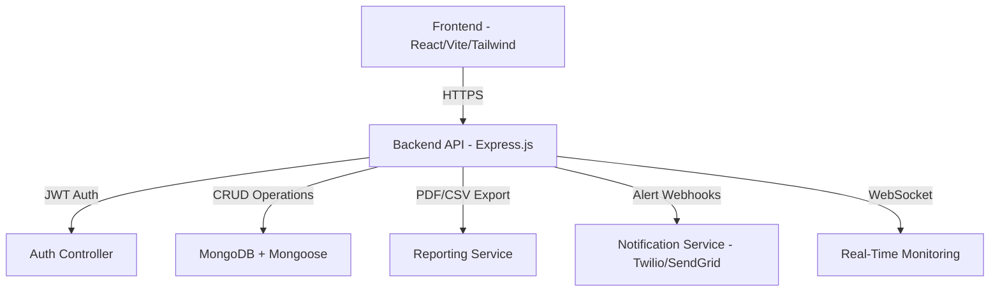

---

<p align="center">

  

</p>


<h1 align="center">🚨 WorkGuard360 — Enterprise Workplace Security & Compliance Platform</h1>


**Smart Workplace Security & Compliance System**

*Intelligent access monitoring, shift enforcement & real-time compliance alerts.*


[](https://workguard360.vercel.app/)

[](https://github.com/Alphadavethedon/Workguard360)

[](LICENSE)

[](https://nodejs.org)

[](https://www.mongodb.com)
---
## Overview

**WorkGuard360** is a production-ready, **MERN-stack** enterprise-grade platform providing:

* **Role-based access control**
* **Live workplace monitoring**
* **Shift compliance enforcement**
* **Auto-generated audit trails**
* **PDF & CSV compliance reports**

Engineered for high-security environments — scalable across Africa and globally.

> Built in Nairobi. Architected for enterprise scale.

---

## System Architecture



---

## Core Features

### Authentication & Access Control

* JWT-secured login
* Role-specific dashboards (**Admin**, **HR**, **Security**)
* Protected API routes with granular permissions

### Real-Time Compliance Monitoring

* Live event stream ingestion
* Unauthorized floor & shift timing violation detection
* Alert feed with resolution workflow

### Shift, Floor & Access Management

* Shift scheduling
* Floor-to-role mapping
* Role-based access enforcement

### Alert Center

* Auto-generation of violations
* Archive / resolve/escalate
* Filter by **role**, **status**, or **time**

### Advanced Reporting

* Weekly PDF/CSV reports (PDFKit & json2csv)
* Custom date/role/floor exports
* Immutable audit trail storage

---

## Live Demo Access

| Role     | Email                                                         | Password    |

| -------- | ------------------------------------------------------------- | ----------- |

| Admin    | [admin@workguard360.com](mailto:admin@workguard360.com)       | demo123     |

| HR       | [hr@workguard360.com](mailto:hr@workguard360.com)             | hr123       |

| Security | [security@workguard360.com](mailto:security@workguard360.com) | security123 |

---

## Tech Stack

| Layer         | Technologies                                |

| ------------- | ------------------------------------------- |

| **Frontend**  | React, Vite, Tailwind CSS, Framer Motion    |

| **Backend**   | Node.js, Express.js, MongoDB, Mongoose, JWT |

| **Dev Tools** | React Query, Axios, Zod, React Hook Form    |

| **Reporting** | PDFKit, json2csv                            |

| **Testing**   | Jest, Supertest, React Testing Library      |

| **CI/CD**     | GitHub Actions                              |

| **Deploy**    | Vercel (Frontend), Render (Backend)         |

---

## Installation

```bash

# Clone repo

git clone https://github.com/Alphadavethedon/Workguard360.git

cd Workguard360


# Install frontend

cd client && npm install


# Install backend

cd ../server && npm install

```

---

## ⚙️ Environment Variables

**`client/.env`**

```env

VITE_API_URL=http://localhost:5000/api

```

**`server/.env`**

```env

PORT=5000

MONGO_URI=your_mongo_connection_string

JWT_SECRET=your_jwt_secret_key

```

---

## ▶️ Running Locally

```bash

# Start backend

cd server

npm run dev


# Start frontend

cd ../client

npm run dev

```

---

## Deployment

### Vercel (Frontend)

```bash

vercel --prod

```

### Render (Backend)

* Connect your GitHub repo
* Add `MONGO_URI` & `JWT_SECRET` in environment variables
* Build command: `npm install`
* Start command: `node server.js`

### Docker (Full Stack)

```bash

docker-compose up --build

```

---

## Testing

```bash

# Backend tests

cd server && npm test


# Frontend tests

cd client && npm test

```

---

## API Documentation

API reference available at:

`https://workguard360-backend.render.com/api/docs` *(Swagger auto-generated)*

---

## Security Notes

* **JWT** tokens signed with 256-bit secret
* MongoDB indexes for fast role-based lookups
* Rate limiting & request sanitization middleware
* Helmet & CORS protection enabled by default

---

## 🤝 Contributing

1. Fork the repo
2. Create a new branch: `git checkout -b feature/your-feature`
3. Commit your changes: `git commit -m 'feat: add new feature'`
4. Push: `git push origin feature/your-feature`
5. Submit PR

---

## License

MIT — free to use, modify, and distribute.

---

## Author

**Davis Wabwile**

Full-Stack Developer · Cloud & AI Engineer

📍 Nairobi, Kenya

📧 [daviswabwile@gmail.com](mailto:daviswabwile@gmail.com)

🌐 [Portfolio](https://davisportfolio.vercel.app)

---
